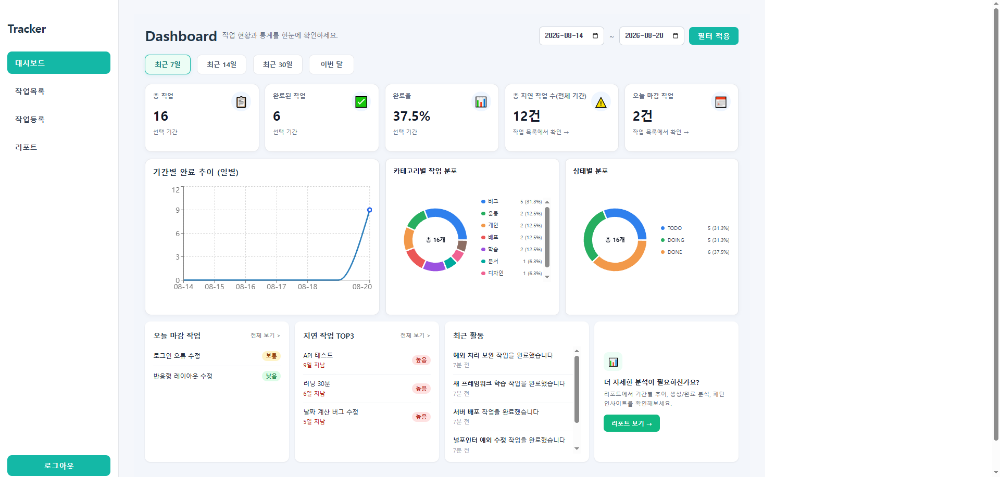
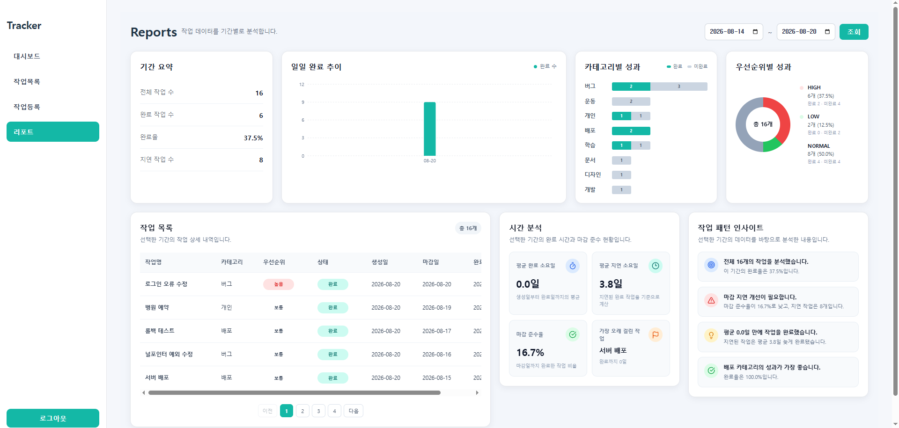
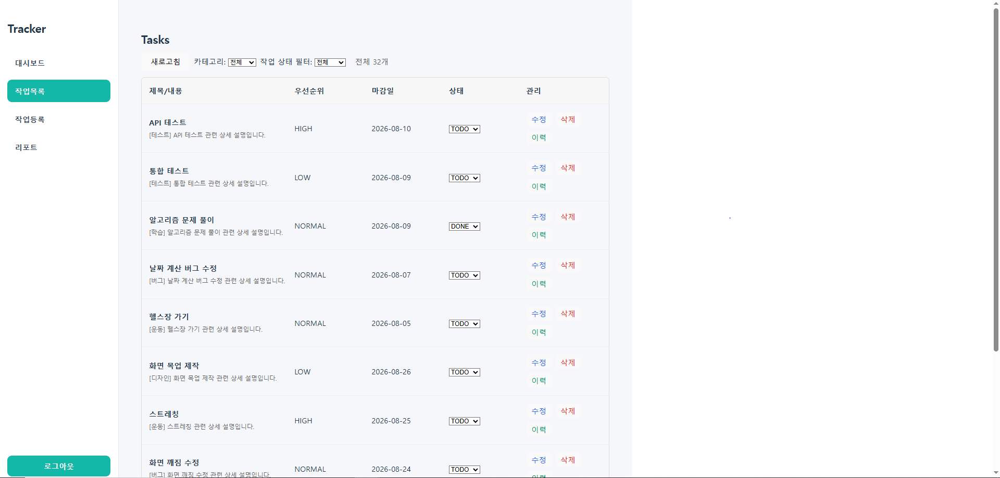
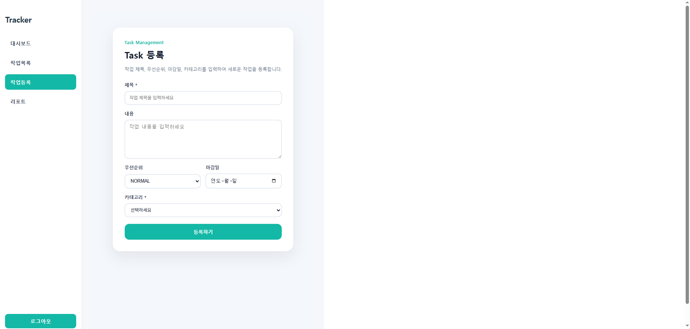
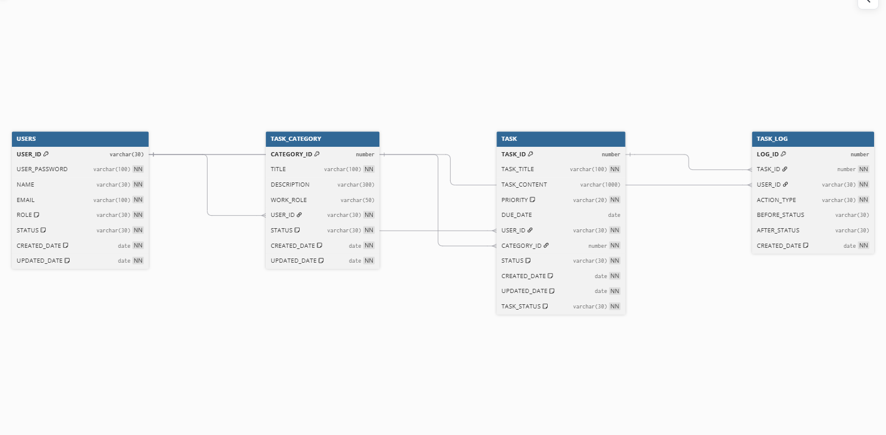

# Task Tracker

## 프로젝트 소개

작업(Task)의 생성·수정·상태 관리를 제공하고, 마감일(DUE_DATE)과 작업 이력(TASK_LOG)을 기반으로
현재 작업 현황과 완료 추이를 분석할 수 있도록 구현한 작업 관리 시스템입니다.

단순히 할 일을 저장하고 끝나는 것이 아니라, 작업을 "관리하는 영역"과 "분석하는 영역"을
명확히 분리하고 그 위에 마감일 기준 통계·트렌드 분석을 쌓아올린 것이 이 프로젝트의 핵심입니다.
(관리와 통계 영역 분리, DUE_DATE 기준 통계, Today/Overdue 분리, Dashboard↔Task List/Reports 연결 구조 등 —
자세한 설계 의도는 [설계 방향](#설계-방향) 참고)

---

## 프로젝트 정보

- 개인 프로젝트
- 개발 기간 : 2026.01 ~ 2026.08
- Backend / Frontend 설계 및 구현
- 개발 목적 : 작업 관리 데이터를 기반으로 현재 작업 현황과 기간별 성과를 분석할 수 있는 관리형 Dashboard/Reports 시스템 구현

---

## 실행 화면

### 대시보드


### 리포트


### 작업 목록


### 작업 등록


### 로그인


---

## 사용 기술

### Backend
- Java 17
- Spring Boot
- Spring Security 6.x
- Spring Session JDBC (세션 기반 인증)
- MyBatis
- Oracle DB
- Gradle

### Frontend
- React
- Vite
- React Router
- Recharts

---

## ERD



### 테이블 설계

- USERS
    - 사용자 계정 정보 관리
    - 로그인 및 사용자별 데이터 분리를 위한 기준 테이블
- TASK_CATEGORY
    - 사용자가 생성한 작업 카테고리 관리
    - 사용자별 카테고리 분리
- TASK
    - 실제 작업 정보 저장
    - 작업 상태(TODO / DOING / DONE)
    - 우선순위 및 마감일 관리
- TASK_LOG
    - 작업 생성/상태 변경/삭제 이력 저장
    - 대시보드 "최근 활동" 및 작업별 이력 조회에 사용

---

## API 명세

### Category API
| Method | URL | 설명 |
|---|---|---|
|GET|`/api/categories`|카테고리 목록 조회|

---

### Task API
| Method | URL | 설명 |
|---|---|---|
|GET|`/api/tasks`|작업 목록 조회 (페이지네이션, 카테고리/상태/마감 필터)|
|GET|`/api/tasks/{taskId}`|작업 단건 조회|
|POST|`/api/tasks`|작업 등록|
|PUT|`/api/tasks/{taskId}`|작업 수정|
|DELETE|`/api/tasks/{taskId}`|작업 삭제|
|PATCH|`/api/tasks/{taskId}/status`|작업 상태 변경|
|GET|`/api/tasks/today`|오늘 마감 작업 목록 조회|
|GET|`/api/tasks/overdue`|마감일 지난 미완료 작업 조회|

---

### Task Log API
| Method | URL | 설명 |
|---|---|---|
|GET|`/api/tasks/{taskId}/logs`|특정 작업의 상태 변경 이력 조회|
|GET|`/api/tasks/recent-activities`|사용자 기준 최근 활동 내역 조회 (limit 개수 제한, 기본 5건)|

---

### Dashboard API
| Method | URL | 설명 |
|---|---|---|
|GET|`/api/dashboard`|대시보드 통계 조회|
|GET|`/api/dashboard/trend`|기간별 완료 추이 조회|

### Dashboard Parameter
|Parameter|설명|적용 API|
|-|-|-|
|startDate|조회 시작일|공통|
|endDate|조회 종료일|공통|
|categoryId|카테고리 필터|공통|
|groupBy|일/주/월 그룹 기준|`/api/dashboard/trend`에만 적용|

---

### Report API
| Method | URL | 설명 |
|---|---|---|
|GET|`/api/reports/summary`|기간 요약 통계 조회|
|GET|`/api/reports/completion-trend`|기간별 완료 추이 조회|
|GET|`/api/reports/category-performance`|카테고리별 성과 조회|
|GET|`/api/reports/priority-performance`|우선순위별 성과 조회|
|GET|`/api/reports/tasks`|기간 내 작업 상세 목록 조회|
|GET|`/api/reports/time-analysis`|완료 시간 및 마감 준수 현황 분석|

### Report Parameter
|Parameter|설명|적용 API|
|-|-|-|
|startDate|조회 시작일|공통|
|endDate|조회 종료일|공통|
|categoryId|카테고리 필터|공통|
|groupBy|일/주/월 그룹 기준|`/api/reports/completion-trend`에만 적용|

---

## 인증 구조

JWT 방식이 아닌 서버 세션 기반 인증 방식을 적용했습니다.
로그인 성공 시 서버의 HttpSession에 사용자 정보를 저장하고,
이후 요청에서는 저장된 세션 정보를 기준으로 사용자 데이터를 조회합니다.

### 인증 흐름

```text
React Login 요청
↓
Spring Controller
↓
Service 사용자 검증
↓
HttpSession 저장
↓
USER_ID 기준 데이터 조회
```

프론트엔드는 세션 쿠키 전달을 위해 다음 옵션을 사용했습니다.

```javascript
fetch("/api/tasks", {
    credentials:"include"
})
```

이를 통해 로그인 사용자별 독립적인 작업 데이터와
대시보드 통계를 제공합니다.

---

## 실행 방법

### 환경 설정

`src/main/resources/application-example.yaml` 파일을 참고하여
`application.yaml` 파일을 생성 후 개인 DB 정보를 입력합니다.

```yaml
spring:
  datasource:
    username: YOUR_DB_USERNAME
    password: YOUR_DB_PASSWORD
```

서버를 처음 실행하면 `DemoDataSeeder`가 데모용 사용자/카테고리/작업 데이터를 자동으로 생성합니다.

---

### Backend 실행

```bash
./gradlew bootRun
```

### Frontend 실행

```bash
cd frontend
npm install
npm run dev
```

### 접속

- http://localhost:5173 에서 확인 가능

---

## 현재 구현된 기능

### 작업 관리
- 작업 생성 / 수정 / 삭제
- 상태 관리 (TODO / DOING / DONE)
- 우선순위 설정
- 카테고리 분류
- 작업별 상태 변경 이력 조회

### 사용자
- 세션 기반 로그인 처리
- 사용자별 작업 데이터 분리

### 대시보드
- 전체 작업 수 / 완료 작업 수 / 완료율
- 우선순위별 분포
- 카테고리별 분포
- 오늘 마감 작업 조회
- 지연 작업 조회
- 지연 작업 TOP3 (우선순위 → 지연일수 기준 정렬)
- 최근 활동 내역 (작업 로그 기반, 상대 시간 표시)
- 리포트 페이지 연결 배너

### 리포트
- 기간 요약 통계
- 일별/주별/월별 완료 추이
- 카테고리별 / 우선순위별 성과
- 완료 시간 및 마감 준수율 분석
- 작업 패턴 인사이트

---

## 핵심 흐름

```
[React] → [Controller] → [Service] → [DAO / MyBatis] → [Oracle]

                    [TASK] ──────────→ [TASK_LOG]
                      │                    │
                      ▼                    ▼
                  Dashboard              Reports
              (현재 작업 현황)         (기간별 성과/추이 분석)
```

TASK는 현재 상태(TODO/DOING/DONE, DUE_DATE 등)를, TASK_LOG는 상태 변경 이력(완료 시점 등)을 담당합니다.
Dashboard는 TASK를 DUE_DATE 기준으로 조회해 "지금 상황"을 보여주고, Reports는 TASK_LOG를 함께 활용해 "기간 동안의 흐름"을 분석합니다.

---

## 설계 방향

### 1. 관리와 통계 영역 분리

- 대시보드 → 작업 현황을 숫자로 확인
- 작업 목록 → 실제 작업 관리

두 영역을 분리해서
데이터 확인과 작업 수행이 섞이지 않도록 설계했습니다.

---

### 2. 마감일(DUE_DATE) 기준 통계

생성일이 아닌, 각 통계가 답해야 하는 질문에 맞는 날짜 기준으로 통계를 구성했습니다.

- 전체 작업 수 / 완료 작업 수 / 상태별 / 카테고리별 분포는 "이 기간에 마감인 작업이 몇 개인가"를 보여줘야 하므로, **DUE_DATE**가 조회 기간에 포함되는 작업을 기준으로 집계합니다.
- 기간별 완료 추이는 "이 기간에 실제로 몇 개를 완료했는가"를 보여줘야 하므로, **TASK_LOG의 DONE 전환 시점(실제 완료일)**을 기준으로 별도 집계합니다.

---

### 3. Today / Overdue 기능 분리

오늘 마감 작업과 지연 작업은 단순 필터가 아니라
사용자가 즉시 확인해야 하는 정보라고 판단하여
별도의 기능으로 분리했습니다.

---

### 4. 대시보드 → 작업목록 연결 구조

대시보드에서는 상세 데이터를 직접 보여주기보다
건수 중심으로 요약하고, 클릭 시 해당 작업 목록으로 이동하도록 설계했습니다.

---

### 5. 대시보드 → 리포트 연결 구조

대시보드는 "지금 상황을 빠르게 훑어보는" 용도로,
리포트는 "기간을 두고 깊게 분석하는" 용도로 역할을 나누었습니다.
대시보드 하단에 리포트 페이지로 연결되는 배너를 두어
두 화면의 목적을 명확히 구분하면서도 자연스럽게 이어지도록 구성했습니다.

---

## 프로젝트 구조

```
backend
├─ controller
├─ service
├─ dao
├─ mapper (MyBatis XML)
└─ vo / dto
frontend
├─ pages
├─ components
├─ hooks
├─ utils
└─ api
```

- Controller는 요청과 응답 처리에만 집중하고,
- Service에서는 실제 비즈니스 로직을 담당하도록 분리했습니다.
- DAO는 데이터베이스 접근만 담당하게 해서 책임을 명확하게 나눴습니다.
- 이와 같이 계층을 분리하여 역할을 명확히 하고,
  유지보수와 확장성을 고려한 구조로 설계했습니다.

---

## 대시보드 리팩터링

초기에는 DashboardPage 내부에서
상태 관리, API 조회, UI 출력 로직을 모두 처리했습니다.
하지만 기능이 증가하면서 컴포넌트 크기가 커지고,
조회 로직과 화면 로직이 섞이기 시작해
유지보수성이 떨어지는 문제가 발생했습니다.

이를 개선하기 위해 역할 기준으로 구조를 분리했습니다.

### 분리 내용

- SummaryCard / DonutChartBox / DailyTrendChart / AnalysisBox 컴포넌트 분리
- TodayTaskListCard / OverdueTopThreeCard / RecentActivityCard / ReportBannerCard 컴포넌트 분리
- DashboardFilter 컴포넌트 분리
- useDashboardData 커스텀 Hook 분리
- 날짜 계산 로직(dateUtils) 분리
- 분석 문장 생성 로직(dashboardAnalysis) 분리
- 인라인 스타일을 컴포넌트별 CSS 파일로 분리

이를 통해

- 페이지 역할 단순화
- 재사용성 향상
- 유지보수성 개선
- UI와 로직 책임 분리

를 목표로 구조를 개선했습니다.

---

## 트러블슈팅

개발 과정에서 겪은 주요 문제와 해결 과정입니다. 문제/원인/해결/설계 포인트 전체 내용은 [TROUBLESHOOTING.md](./TROUBLESHOOTING.md)에 정리했습니다.

### 1. MyBatis INSERT 시 STATUS / TASK_STATUS 컬럼 매핑 누락

작업 생성 시 서비스 계층에서 상태값을 설정해도 항상 DB 기본값으로만 저장되는 문제였습니다. INSERT SQL에 두 컬럼 바인딩이 누락되어 있었고, STATUS(데이터 생명주기: ACTIVE/DELETED)와 TASK_STATUS(업무 진행 상태: TODO/DOING/DONE)를 역할별로 분리 설계한 의도가 SQL에 온전히 반영되지 않았던 사례입니다.

### 2. Dashboard 통계 기준을 DUE_DATE로 통일

초기 통계가 CREATED_DATE(생성일) 기준이라 실제 업무 흐름과 맞지 않았던 문제입니다. 통계마다 "어떤 질문에 답해야 하는가"를 재검토해, 마감 여부를 보는 지표는 DUE_DATE로, 완료 시점을 보는 지표(완료 추이)는 TASK_LOG 기반 실제 완료일로 기준을 나누어 재설계했습니다.

### 3. 마감 준수율 / 평균 완료 소요일이 0으로만 계산되는 문제

데모 데이터가 TASK만 DONE으로 생성하고 TASK_LOG에는 완료 이력을 남기지 않아, 시간 기반 분석 지표가 전부 0으로 집계되던 문제입니다. DemoDataSeeder가 TASK_LOG도 함께 생성하도록 수정해 해결했습니다.

---

## 그 외 개선 / 버그 수정

### 백엔드 코드 정리
- **ORA-00918 ambiguous column 오류**: 카테고리별 통계 조회 시 JOIN한 TASK, CATEGORY 테이블에 동일한 컬럼명이 존재해 발생. 모든 JOIN 구문에 컬럼 alias를 명확히 지정해 해결
- **세션 로그인 사용자 조회 로직 중복**: 세션에서 로그인 사용자 ID를 꺼내는 로직이 TaskController, TaskLogController 등 여러 컨트롤러에 중복 구현되어 있던 문제. `SessionUtils` 공통 유틸 클래스로 추출해 중복 제거
- **미사용 코드 정리**: 실제로 어떤 Service/Controller에서도 호출되지 않던 `DashboardDAO.countOverdueTasks`(죽은 코드) 삭제

### UI/UX 개선
- Dashboard 하단 카드(오늘 마감 / 지연 TOP3 / 최근 활동 / 리포트 배너) 높이를 300px로 고정하고 내부 리스트만 스크롤 처리해 카드 간 높이 불일치 해결
- Dashboard/Reports 컨테이너에 `width`를 함께 지정해 페이지 전환 시 레이아웃 폭이 달라지던 문제 해결
- 사이드바에 `position: sticky` / `height: 100vh`를 적용하고 로그아웃 버튼을 `margin-top: auto`로 변경해, 페이지마다 달라지던 로그아웃 버튼 위치를 하단에 고정

---

## 개선 예정

1. **Dashboard 분석 기능 고도화**
   완료율 변화 / 지연 비율 자동 분석, 요약 카드에 지난주 대비 증감 표시 등 분석 코멘트 기능 확장
2. **통계 쿼리 공통화 및 성능 개선**
   Report/Dashboard에 중복 존재하는 완료 추이(countCompletionTrend) 로직 통합, 대시보드 데이터 캐싱 적용
3. **Calendar 기능 추가**
   월별/주별 캘린더 뷰에서 작업을 날짜별로 확인할 수 있는 기능 (포트폴리오 마무리 후 별도 구현 예정)
4. **작업 목록 페이지 UI 개선**
   브라우저 기본 confirm/alert 대신 통일된 디자인의 커스텀 모달 적용 범위 확대
